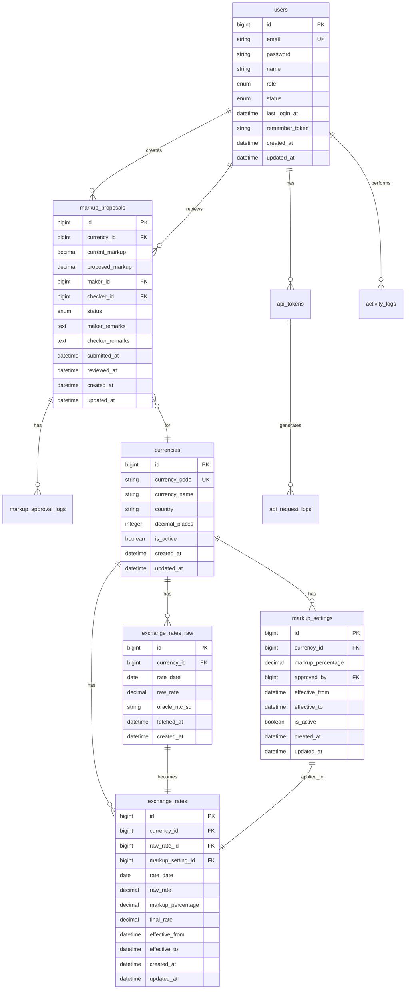

# Database Design Document
## Sistem Informasi Kurs dengan Markup Management

---

## 1. DATABASE OVERVIEW

### 1.1 Database Information
- **Database System**: MySQL/PostgreSQL (Application Database)
- **External Database**: Oracle (Source Exchange Rates)
- **Encoding**: UTF-8
- **Collation**: utf8mb4_unicode_ci
- **Storage Engine**: InnoDB (for MySQL)
- **Timezone**: Asia/Jakarta (UTC+7)

### 1.2 Naming Conventions
- **Tables**: Plural, snake_case (e.g., `exchange_rates`)
- **Columns**: Singular, snake_case (e.g., `currency_code`)
- **Primary Keys**: `id` (unsigned bigint)
- **Foreign Keys**: `{table_singular}_id` (e.g., `user_id`)
- **Indexes**: `idx_{table}_{column(s)}` (e.g., `idx_exchange_rates_currency`)
- **Unique Constraints**: `uniq_{table}_{column(s)}`
- **Timestamps**: `created_at`, `updated_at`, `deleted_at`

---

## 2. ENTITY RELATIONSHIP DIAGRAM (ERD)



---

## 3. TABLE SPECIFICATIONS

### 3.1 users
**Description**: Stores system user information with role-based access

| Column | Type | Constraints | Description |
|--------|------|------------|-------------|
| id | BIGINT UNSIGNED | PK, AUTO_INCREMENT | Primary key |
| email | VARCHAR(100) | UNIQUE, NOT NULL | User email for login |
| password | VARCHAR(255) | NOT NULL | Hashed password (bcrypt) |
| name | VARCHAR(100) | NOT NULL | User full name |
| role | ENUM | NOT NULL | 'maker', 'checker', 'viewer', 'admin' |
| status | ENUM | NOT NULL, DEFAULT 'active' | 'active', 'inactive', 'suspended' |
| last_login_at | TIMESTAMP | NULL | Last successful login |
| remember_token | VARCHAR(100) | NULL | Laravel remember token |
| created_at | TIMESTAMP | NOT NULL | Record creation time |
| updated_at | TIMESTAMP | NOT NULL | Last update time |
| deleted_at | TIMESTAMP | NULL | Soft delete timestamp |

**Indexes**:
- `PRIMARY KEY (id)`
- `UNIQUE KEY uniq_users_email (email)`
- `INDEX idx_users_role (role)`
- `INDEX idx_users_status (status)`

---

### 3.2 currencies
**Description**: Master table for currency information

| Column | Type | Constraints | Description |
|--------|------|------------|-------------|
| id | BIGINT UNSIGNED | PK, AUTO_INCREMENT | Primary key |
| currency_code | VARCHAR(3) | UNIQUE, NOT NULL | ISO 4217 currency code |
| currency_name | VARCHAR(50) | NOT NULL | Full currency name |
| country | VARCHAR(100) | NULL | Country/region name |
| decimal_places | TINYINT | NOT NULL, DEFAULT 4 | Number of decimal places |
| is_active | BOOLEAN | NOT NULL, DEFAULT TRUE | Active status |
| display_order | INTEGER | NULL | Display ordering |
| created_at | TIMESTAMP | NOT NULL | Record creation time |
| updated_at | TIMESTAMP | NOT NULL | Last update time |

**Indexes**:
- `PRIMARY KEY (id)`
- `UNIQUE KEY uniq_currencies_code (currency_code)`
- `INDEX idx_currencies_active (is_active)`

**Sample Data**:
```sql
INSERT INTO currencies (currency_code, currency_name, country, decimal_places) VALUES
('USD', 'US Dollar', 'United States', 4),
('EUR', 'Euro', 'European Union', 4),
('KRW', 'Korean Won', 'South Korea', 4),
('JPY', 'Japanese Yen', 'Japan', 4);
```

---

### 3.3 exchange_rates_raw
**Description**: Stores raw exchange rates fetched from Oracle database

| Column | Type | Constraints | Description |
|--------|------|------------|-------------|
| id | BIGINT UNSIGNED | PK, AUTO_INCREMENT | Primary key |
| currency_id | BIGINT UNSIGNED | FK, NOT NULL | Reference to currencies |
| rate_date | DATE | NOT NULL | NTC_DT from Oracle |
| raw_rate | DECIMAL(20,4) | NOT NULL | TTS value from Oracle |
| oracle_ntc_sq | VARCHAR(20) | NULL | NTC_SQ from Oracle |
| fetch_status | ENUM | NOT NULL, DEFAULT 'success' | 'success', 'failed', 'partial' |
| fetch_message | TEXT | NULL | Error message if failed |
| fetched_at | TIMESTAMP | NOT NULL | When data was fetched |
| created_at | TIMESTAMP | NOT NULL | Record creation time |

**Indexes**:
- `PRIMARY KEY (id)`
- `FOREIGN KEY (currency_id) REFERENCES currencies(id)`
- `UNIQUE KEY uniq_raw_rates (currency_id, rate_date, fetched_at)`
- `INDEX idx_raw_rates_date (rate_date)`
- `INDEX idx_raw_rates_fetched (fetched_at)`

---

### 3.4 exchange_rates
**Description**: Stores final exchange rates with applied markup

| Column | Type | Constraints | Description |
|--------|------|------------|-------------|
| id | BIGINT UNSIGNED | PK, AUTO_INCREMENT | Primary key |
| currency_id | BIGINT UNSIGNED | FK, NOT NULL | Reference to currencies |
| raw_rate_id | BIGINT UNSIGNED | FK, NOT NULL | Reference to exchange_rates_raw |
| markup_setting_id | BIGINT UNSIGNED | FK, NULL | Reference to markup_settings |
| rate_date | DATE | NOT NULL | Exchange rate date |
| raw_rate | DECIMAL(20,4) | NOT NULL | Original rate from Oracle |
| markup_percentage | DECIMAL(5,2) | NOT NULL, DEFAULT 0 | Applied markup % |
| final_rate | DECIMAL(20,4) | NOT NULL | Calculated final rate |
| effective_from | TIMESTAMP | NOT NULL | When rate becomes effective |
| effective_to | TIMESTAMP | NULL | When rate expires |
| is_current | BOOLEAN | NOT NULL, DEFAULT FALSE | Current active rate flag |
| created_at | TIMESTAMP | NOT NULL | Record creation time |
| updated_at | TIMESTAMP | NOT NULL | Last update time |

**Indexes**:
- `PRIMARY KEY (id)`
- `FOREIGN KEY (currency_id) REFERENCES currencies(id)`
- `FOREIGN KEY (raw_rate_id) REFERENCES exchange_rates_raw(id)`
- `FOREIGN KEY (markup_setting_id) REFERENCES markup_settings(id)`
- `INDEX idx_exchange_rates_current (is_current, currency_id)`
- `INDEX idx_exchange_rates_date (rate_date, currency_id)`
- `INDEX idx_exchange_rates_effective (effective_from, effective_to)`

**Trigger for final_rate calculation**:
```sql
CREATE TRIGGER calculate_final_rate 
BEFORE INSERT ON exchange_rates
FOR EACH ROW
SET NEW.final_rate = NEW.raw_rate + (NEW.raw_rate * NEW.markup_percentage / 100);
```

---

### 3.5 markup_settings
**Description**: Stores approved markup percentages for each currency

| Column | Type | Constraints | Description |
|--------|------|------------|-------------|
| id | BIGINT UNSIGNED | PK, AUTO_INCREMENT | Primary key |
| currency_id | BIGINT UNSIGNED | FK, NOT NULL | Reference to currencies |
| markup_percentage | DECIMAL(5,2) | NOT NULL | Markup percentage (e.g., 1.50) |
| approved_by | BIGINT UNSIGNED | FK, NOT NULL | User who approved |
| approved_proposal_id | BIGINT UNSIGNED | FK, NULL | Reference to markup_proposals |
| effective_from | TIMESTAMP | NOT NULL | When markup becomes effective |
| effective_to | TIMESTAMP | NULL | When markup expires |
| is_active | BOOLEAN | NOT NULL, DEFAULT TRUE | Active status |
| created_at | TIMESTAMP | NOT NULL | Record creation time |
| updated_at | TIMESTAMP | NOT NULL | Last update time |

**Indexes**:
- `PRIMARY KEY (id)`
- `FOREIGN KEY (currency_id) REFERENCES currencies(id)`
- `FOREIGN KEY (approved_by) REFERENCES users(id)`
- `FOREIGN KEY (approved_proposal_id) REFERENCES markup_proposals(id)`
- `INDEX idx_markup_settings_active (is_active, currency_id)`
- `INDEX idx_markup_settings_effective (effective_from, effective_to)`

---

### 3.6 markup_proposals
**Description**: Stores markup change proposals with approval workflow

| Column | Type | Constraints | Description |
|--------|------|------------|-------------|
| id | BIGINT UNSIGNED | PK, AUTO_INCREMENT | Primary key |
| currency_id | BIGINT UNSIGNED | FK, NOT NULL | Reference to currencies |
| current_markup | DECIMAL(5,2) | NULL | Current active markup |
| proposed_markup | DECIMAL(5,2) | NOT NULL | Proposed new markup |
| maker_id | BIGINT UNSIGNED | FK, NOT NULL | User who created proposal |
| checker_id | BIGINT UNSIGNED | FK, NULL | User who reviewed |
| status | ENUM | NOT NULL, DEFAULT 'pending' | 'pending', 'approved', 'rejected', 'cancelled' |
| maker_remarks | TEXT | NULL | Maker's notes |
| checker_remarks | TEXT | NULL | Checker's review notes |
| submitted_at | TIMESTAMP | NOT NULL | When proposal submitted |
| reviewed_at | TIMESTAMP | NULL | When reviewed |
| created_at | TIMESTAMP | NOT NULL | Record creation time |
| updated_at | TIMESTAMP | NOT NULL | Last update time |

**Indexes**:
- `PRIMARY KEY (id)`
- `FOREIGN KEY (currency_id) REFERENCES currencies(id)`
- `FOREIGN KEY (maker_id) REFERENCES users(id)`
- `FOREIGN KEY (checker_id) REFERENCES users(id)`
- `INDEX idx_proposals_status (status)`
- `INDEX idx_proposals_maker (maker_id, status)`
- `INDEX idx_proposals_checker (checker_id, status)`
- `INDEX idx_proposals_date (submitted_at)`

---

### 3.7 markup_approval_logs
**Description**: Audit trail for all markup approval actions

| Column | Type | Constraints | Description |
|--------|------|------------|-------------|
| id | BIGINT UNSIGNED | PK, AUTO_INCREMENT | Primary key |
| proposal_id | BIGINT UNSIGNED | FK, NOT NULL | Reference to markup_proposals |
| action | ENUM | NOT NULL | 'submitted', 'approved', 'rejected', 'cancelled' |
| action_by | BIGINT UNSIGNED | FK, NOT NULL | User who performed action |
| action_remarks | TEXT | NULL | Action notes |
| previous_status | VARCHAR(20) | NULL | Status before action |
| new_status | VARCHAR(20) | NOT NULL | Status after action |
| created_at | TIMESTAMP | NOT NULL | Action timestamp |

**Indexes**:
- `PRIMARY KEY (id)`
- `FOREIGN KEY (proposal_id) REFERENCES markup_proposals(id)`
- `FOREIGN KEY (action_by) REFERENCES users(id)`
- `INDEX idx_approval_logs_proposal (proposal_id)`
- `INDEX idx_approval_logs_action (action)`

---

### 3.8 api_tokens
**Description**: JWT tokens for API authentication

| Column | Type | Constraints | Description |
|--------|------|------------|-------------|
| id | BIGINT UNSIGNED | PK, AUTO_INCREMENT | Primary key |
| user_id | BIGINT UNSIGNED | FK, NOT NULL | Reference to users |
| token_name | VARCHAR(100) | NULL | Optional token identifier |
| token | TEXT | NOT NULL | JWT token string |
| abilities | TEXT | NULL | JSON array of permissions |
| last_used_at | TIMESTAMP | NULL | Last API call timestamp |
| expires_at | TIMESTAMP | NOT NULL | Token expiration |
| is_revoked | BOOLEAN | NOT NULL, DEFAULT FALSE | Revocation status |
| created_at | TIMESTAMP | NOT NULL | Token creation time |
| updated_at | TIMESTAMP | NOT NULL | Last update time |

**Indexes**:
- `PRIMARY KEY (id)`
- `FOREIGN KEY (user_id) REFERENCES users(id)`
- `INDEX idx_tokens_user (user_id, is_revoked)`
- `INDEX idx_tokens_expires (expires_at)`
- `INDEX idx_tokens_token (token(255))`

---

### 3.9 api_request_logs
**Description**: Logs all API requests for monitoring and auditing

| Column | Type | Constraints | Description |
|--------|------|------------|-------------|
| id | BIGINT UNSIGNED | PK, AUTO_INCREMENT | Primary key |
| token_id | BIGINT UNSIGNED | FK, NULL | Reference to api_tokens |
| user_id | BIGINT UNSIGNED | FK, NULL | Reference to users |
| endpoint | VARCHAR(255) | NOT NULL | API endpoint called |
| method | VARCHAR(10) | NOT NULL | HTTP method |
| parameters | JSON | NULL | Request parameters |
| ip_address | VARCHAR(45) | NOT NULL | Client IP address |
| user_agent | TEXT | NULL | Client user agent |
| response_code | VARCHAR(3) | NOT NULL | Response code (00, 01, etc) |
| response_time | INTEGER | NOT NULL | Response time in ms |
| created_at | TIMESTAMP | NOT NULL | Request timestamp |

**Indexes**:
- `PRIMARY KEY (id)`
- `FOREIGN KEY (token_id) REFERENCES api_tokens(id)`
- `FOREIGN KEY (user_id) REFERENCES users(id)`
- `INDEX idx_api_logs_user (user_id)`
- `INDEX idx_api_logs_endpoint (endpoint)`
- `INDEX idx_api_logs_date (created_at)`
- `INDEX idx_api_logs_response (response_code)`

---

### 3.10 activity_logs
**Description**: General activity logging for audit trail

| Column | Type | Constraints | Description |
|--------|------|------------|-------------|
| id | BIGINT UNSIGNED | PK, AUTO_INCREMENT | Primary key |
| user_id | BIGINT UNSIGNED | FK, NULL | Reference to users |
| activity_type | VARCHAR(50) | NOT NULL | Type of activity |
| activity_description | TEXT | NOT NULL | Detailed description |
| subject_type | VARCHAR(100) | NULL | Model type (polymorphic) |
| subject_id | BIGINT UNSIGNED | NULL | Model ID (polymorphic) |
| properties | JSON | NULL | Additional properties |
| ip_address | VARCHAR(45) | NULL | User IP address |
| user_agent | TEXT | NULL | User browser info |
| created_at | TIMESTAMP | NOT NULL | Activity timestamp |

**Indexes**:
- `PRIMARY KEY (id)`
- `FOREIGN KEY (user_id) REFERENCES users(id)`
- `INDEX idx_activity_user (user_id)`
- `INDEX idx_activity_type (activity_type)`
- `INDEX idx_activity_subject (subject_type, subject_id)`
- `INDEX idx_activity_date (created_at)`

---

### 3.11 scheduled_jobs
**Description**: Tracks scheduled job executions

| Column | Type | Constraints | Description |
|--------|------|------------|-------------|
| id | BIGINT UNSIGNED | PK, AUTO_INCREMENT | Primary key |
| job_name | VARCHAR(100) | NOT NULL | Job identifier |
| job_type | ENUM | NOT NULL | 'fetch_rates', 'cleanup', 'report' |
| status | ENUM | NOT NULL | 'pending', 'running', 'success', 'failed' |
| started_at | TIMESTAMP | NULL | Job start time |
| completed_at | TIMESTAMP | NULL | Job completion time |
| error_message | TEXT | NULL | Error details if failed |
| records_processed | INTEGER | NULL | Number of records processed |
| created_at | TIMESTAMP | NOT NULL | Record creation time |

**Indexes**:
- `PRIMARY KEY (id)`
- `INDEX idx_jobs_type (job_type)`
- `INDEX idx_jobs_status (status)`
- `INDEX idx_jobs_date (created_at)`

---

### 3.12 cache_table (Optional - for database caching)
**Description**: Laravel cache storage if using database driver

| Column | Type | Constraints | Description |
|--------|------|------------|-------------|
| key | VARCHAR(255) | PK | Cache key |
| value | MEDIUMTEXT | NOT NULL | Cached value |
| expiration | INTEGER | NOT NULL | Unix timestamp |

**Indexes**:
- `PRIMARY KEY (key)`
- `INDEX idx_cache_expiration (expiration)`

---

## 4. DATABASE VIEWS

### 4.1 v_current_exchange_rates
**Purpose**: Simplified view for current active exchange rates

```sql
CREATE VIEW v_current_exchange_rates AS
SELECT 
    c.currency_code,
    c.currency_name,
    er.rate_date,
    er.raw_rate,
    er.markup_percentage,
    er.final_rate,
    er.effective_from,
    er.updated_at as last_updated
FROM exchange_rates er
INNER JOIN currencies c ON er.currency_id = c.id
WHERE er.is_current = TRUE
    AND c.is_active = TRUE
ORDER BY c.display_order, c.currency_code;
```

### 4.2 v_pending_proposals
**Purpose**: View for pending markup proposals

```sql
CREATE VIEW v_pending_proposals AS
SELECT 
    mp.id as proposal_id,
    c.currency_code,
    c.currency_name,
    mp.current_markup,
    mp.proposed_markup,
    u.name as maker_name,
    mp.maker_remarks,
    mp.submitted_at
FROM markup_proposals mp
INNER JOIN currencies c ON mp.currency_id = c.id
INNER JOIN users u ON mp.maker_id = u.id
WHERE mp.status = 'pending'
ORDER BY mp.submitted_at DESC;
```

### 4.3 v_api_usage_stats
**Purpose**: API usage statistics per user

```sql
CREATE VIEW v_api_usage_stats AS
SELECT 
    u.id as user_id,
    u.name,
    u.email,
    DATE(arl.created_at) as usage_date,
    COUNT(*) as total_requests,
    AVG(arl.response_time) as avg_response_time,
    SUM(CASE WHEN arl.response_code = '00' THEN 1 ELSE 0 END) as successful_requests,
    SUM(CASE WHEN arl.response_code != '00' THEN 1 ELSE 0 END) as failed_requests
FROM users u
LEFT JOIN api_request_logs arl ON u.id = arl.user_id
GROUP BY u.id, DATE(arl.created_at);
```

---

## 5. STORED PROCEDURES

### 5.1 sp_fetch_and_calculate_rates
**Purpose**: Fetch rates from Oracle and calculate final rates

```sql
DELIMITER //
CREATE PROCEDURE sp_fetch_and_calculate_rates()
BEGIN
    DECLARE v_currency_id BIGINT;
    DECLARE v_raw_rate DECIMAL(20,4);
    DECLARE v_markup DECIMAL(5,2);
    DECLARE done INT DEFAULT FALSE;
    
    -- Cursor for processing each currency
    DECLARE cur CURSOR FOR 
        SELECT id FROM currencies WHERE is_active = TRUE;
    
    DECLARE CONTINUE HANDLER FOR NOT FOUND SET done = TRUE;
    
    START TRANSACTION;
    
    -- Mark current rates as not current
    UPDATE exchange_rates SET is_current = FALSE WHERE is_current = TRUE;
    
    OPEN cur;
    
    read_loop: LOOP
        FETCH cur INTO v_currency_id;
        IF done THEN
            LEAVE read_loop;
        END IF;
        
        -- Get latest markup for currency
        SELECT markup_percentage INTO v_markup
        FROM markup_settings
        WHERE currency_id = v_currency_id 
            AND is_active = TRUE
            AND NOW() BETWEEN effective_from AND IFNULL(effective_to, '2099-12-31')
        ORDER BY effective_from DESC
        LIMIT 1;
        
        -- If no markup found, use 0
        IF v_markup IS NULL THEN
            SET v_markup = 0;
        END IF;
        
        -- Insert new rate with calculation
        -- (Actual Oracle fetch would happen here)
        -- This is a placeholder for the logic
        
    END LOOP;
    
    CLOSE cur;
    
    COMMIT;
END//
DELIMITER ;
```

### 5.2 sp_approve_markup_proposal
**Purpose**: Approve markup proposal and create setting

```sql
DELIMITER //
CREATE PROCEDURE sp_approve_markup_proposal(
    IN p_proposal_id BIGINT,
    IN p_checker_id BIGINT,
    IN p_remarks TEXT
)
BEGIN
    DECLARE v_currency_id BIGINT;
    DECLARE v_proposed_markup DECIMAL(5,2);
    
    START TRANSACTION;
    
    -- Get proposal details
    SELECT currency_id, proposed_markup 
    INTO v_currency_id, v_proposed_markup
    FROM markup_proposals
    WHERE id = p_proposal_id AND status = 'pending';
    
    -- Update proposal status
    UPDATE markup_proposals
    SET status = 'approved',
        checker_id = p_checker_id,
        checker_remarks = p_remarks,
        reviewed_at = NOW(),
        updated_at = NOW()
    WHERE id = p_proposal_id;
    
    -- Deactivate current markup
    UPDATE markup_settings
    SET is_active = FALSE,
        effective_to = NOW()
    WHERE currency_id = v_currency_id AND is_active = TRUE;
    
    -- Create new markup setting
    INSERT INTO markup_settings (
        currency_id, 
        markup_percentage, 
        approved_by,
        approved_proposal_id,
        effective_from,
        is_active
    ) VALUES (
        v_currency_id,
        v_proposed_markup,
        p_checker_id,
        p_proposal_id,
        NOW(),
        TRUE
    );
    
    -- Log the approval
    INSERT INTO markup_approval_logs (
        proposal_id,
        action,
        action_by,
        action_remarks,
        previous_status,
        new_status,
        created_at
    ) VALUES (
        p_proposal_id,
        'approved',
        p_checker_id,
        p_remarks,
        'pending',
        'approved',
        NOW()
    );
    
    COMMIT;
END//
DELIMITER ;
```

---

## 6. INDEXES STRATEGY

### 6.1 Primary Indexes
- All primary keys are automatically indexed
- Foreign keys should have indexes for join performance

### 6.2 Performance Indexes
```sql
-- For frequent queries by date
CREATE INDEX idx_exchange_rates_date_currency 
ON exchange_rates(rate_date, currency_id, is_current);

-- For API performance
CREATE INDEX idx_api_logs_user_date 
ON api_request_logs(user_id, created_at DESC);

-- For markup workflow
CREATE INDEX idx_proposals_pending 
ON markup_proposals(status, submitted_at) 
WHERE status = 'pending';
```

### 6.3 Covering Indexes
```sql
-- For API response generation
CREATE INDEX idx_rates_api_response 
ON exchange_rates(currency_id, is_current, final_rate, effective_from)
INCLUDE (rate_date, markup_percentage);
```

---

## 7. DATA MIGRATION SCRIPTS

### 7.1 Initial Currency Setup
```sql
INSERT INTO currencies (currency_code, currency_name, country, display_order) VALUES
('USD', 'US Dollar', 'United States', 1),
('EUR', 'Euro', 'European Union', 2),
('GBP', 'British Pound', 'United Kingdom', 3),
('JPY', 'Japanese Yen', 'Japan', 4),
('KRW', 'Korean Won', 'South Korea', 5),
('SGD', 'Singapore Dollar', 'Singapore', 6),
('HKD', 'Hong Kong Dollar', 'Hong Kong', 7),
('AUD', 'Australian Dollar', 'Australia', 8),
('CAD', 'Canadian Dollar', 'Canada', 9),
('CHF', 'Swiss Franc', 'Switzerland', 10),
('MYR', 'Malaysian Ringgit', 'Malaysia', 11),
('SAR', 'Saudi Riyal', 'Saudi Arabia', 12);
```

### 7.2 Default Admin User
```sql
INSERT INTO users (email, password, name, role, status) VALUES
('admin@system.com', '$2y$10$...', 'System Administrator', 'admin', 'active');
```

---

## 8. BACKUP & MAINTENANCE

### 8.1 Backup Strategy
```sql
-- Daily backup of transactional tables
mysqldump -u root -p database_name \
    exchange_rates exchange_rates_raw markup_proposals \
    markup_approval_logs api_request_logs \
    > backup_transactional_$(date +%Y%m%d).sql

-- Weekly full backup
mysqldump -u root -p --all-databases \
    > backup_full_$(date +%Y%m%d).sql
```

### 8.2 Data Retention Policy
```sql
-- Clean old API logs (keep 90 days)
DELETE FROM api_request_logs 
WHERE created_at < DATE_SUB(NOW(), INTERVAL 90 DAY);

-- Archive old exchange rates (keep 1 year active)
INSERT INTO exchange_rates_archive 
SELECT * FROM exchange_rates 
WHERE rate_date < DATE_SUB(NOW(), INTERVAL 1 YEAR);

DELETE FROM exchange_rates 
WHERE rate_date < DATE_SUB(NOW(), INTERVAL 1 YEAR);
```

### 8.3 Performance Optimization
```sql
-- Regular ANALYZE for query optimization
ANALYZE TABLE exchange_rates;
ANALYZE TABLE api_request_logs;

-- Optimize fragmented tables
OPTIMIZE TABLE exchange_rates;
OPTIMIZE TABLE api_request_logs;
```

---

## 9. SECURITY CONSIDERATIONS

### 9.1 Data Encryption
- Sensitive columns (like API tokens) should be encrypted at rest
- Use Laravel's encryption for sensitive data

### 9.2 Access Control
```sql
-- Create separate database users for different access levels
CREATE USER 'app_user'@'localhost' IDENTIFIED BY 'password';
GRANT SELECT, INSERT, UPDATE ON database.* TO 'app_user'@'localhost';

CREATE USER 'api_user'@'%' IDENTIFIED BY 'password';
GRANT SELECT ON database.v_current_exchange_rates TO 'api_user'@'%';
```

### 9.3 Audit Requirements
- All data modifications logged in activity_logs
- Sensitive operations require dual control (maker-checker)
- Regular audit of api_request_logs for suspicious activity

---

## 10. LARAVEL MIGRATION FILES

### 10.1 Migration Order
```
1. 2025_01_01_000001_create_users_table.php
2. 2025_01_01_000002_create_currencies_table.php
3. 2025_01_01_000003_create_exchange_rates_raw_table.php
4. 2025_01_01_000004_create_markup_settings_table.php
5. 2025_01_01_000005_create_exchange_rates_table.php
6. 2025_01_01_000006_create_markup_proposals_table.php
7. 2025_01_01_000007_create_markup_approval_logs_table.php
8. 2025_01_01_000008_create_api_tokens_table.php
9. 2025_01_01_000009_create_api_request_logs_table.php
10. 2025_01_01_000010_create_activity_logs_table.php
11. 2025_01_01_000011_create_scheduled_jobs_table.php
12. 2025_01_01_000012_create_views.php
13. 2025_01_01_000013_create_stored_procedures.php
```

### 10.2 Sample Migration File
```php
<?php
// 2025_01_01_000005_create_exchange_rates_table.php

use Illuminate\Database\Migrations\Migration;
use Illuminate\Database\Schema\Blueprint;
use Illuminate\Support\Facades\Schema;

return new class extends Migration
{
    public function up(): void
    {
        Schema::create('exchange_rates', function (Blueprint $table) {
            $table->id();
            $table->foreignId('currency_id')->constrained();
            $table->foreignId('raw_rate_id')
                  ->constrained('exchange_rates_raw');
            $table->foreignId('markup_setting_id')
                  ->nullable()
                  ->constrained('markup_settings');
            $table->date('rate_date');
            $table->decimal('raw_rate', 20, 4);
            $table->decimal('markup_percentage', 5, 2)->default(0);
            $table->decimal('final_rate', 20, 4);
            $table->timestamp('effective_from');
            $table->timestamp('effective_to')->nullable();
            $table->boolean('is_current')->default(false);
            $table->timestamps();
            
            // Indexes
            $table->index(['is_current', 'currency_id']);
            $table->index(['rate_date', 'currency_id']);
            $table->index(['effective_from', 'effective_to']);
        });
    }

    public function down(): void
    {
        Schema::dropIfExists('exchange_rates');
    }
};
```

---

## 11. ELOQUENT MODEL RELATIONSHIPS

### 11.1 User Model
```php
<?php
namespace App\Models;

use Illuminate\Foundation\Auth\User as Authenticatable;
use Laravel\Sanctum\HasApiTokens;

class User extends Authenticatable
{
    use HasApiTokens;
    
    protected $fillable = [
        'email', 'password', 'name', 'role', 'status'
    ];
    
    protected $hidden = [
        'password', 'remember_token'
    ];
    
    protected $casts = [
        'last_login_at' => 'datetime',
        'created_at' => 'datetime',
        'updated_at' => 'datetime'
    ];
    
    // Relationships
    public function markupProposalsMade()
    {
        return $this->hasMany(MarkupProposal::class, 'maker_id');
    }
    
    public function markupProposalsReviewed()
    {
        return $this->hasMany(MarkupProposal::class, 'checker_id');
    }
    
    public function apiTokens()
    {
        return $this->hasMany(ApiToken::class);
    }
    
    public function activityLogs()
    {
        return $this->hasMany(ActivityLog::class);
    }
    
    // Scopes
    public function scopeActive($query)
    {
        return $query->where('status', 'active');
    }
    
    public function scopeByRole($query, $role)
    {
        return $query->where('role', $role);
    }
}
```

### 11.2 Currency Model
```php
<?php
namespace App\Models;

use Illuminate\Database\Eloquent\Model;

class Currency extends Model
{
    protected $fillable = [
        'currency_code', 'currency_name', 'country', 
        'decimal_places', 'is_active', 'display_order'
    ];
    
    protected $casts = [
        'is_active' => 'boolean',
        'decimal_places' => 'integer',
        'display_order' => 'integer'
    ];
    
    // Relationships
    public function exchangeRatesRaw()
    {
        return $this->hasMany(ExchangeRateRaw::class);
    }
    
    public function exchangeRates()
    {
        return $this->hasMany(ExchangeRate::class);
    }
    
    public function markupSettings()
    {
        return $this->hasMany(MarkupSetting::class);
    }
    
    public function markupProposals()
    {
        return $this->hasMany(MarkupProposal::class);
    }
    
    // Get current active markup
    public function currentMarkup()
    {
        return $this->markupSettings()
            ->where('is_active', true)
            ->where('effective_from', '<=', now())
            ->where(function($query) {
                $query->whereNull('effective_to')
                    ->orWhere('effective_to', '>', now());
            })
            ->latest('effective_from')
            ->first();
    }
    
    // Get current exchange rate
    public function currentRate()
    {
        return $this->exchangeRates()
            ->where('is_current', true)
            ->first();
    }
}
```

### 11.3 ExchangeRate Model
```php
<?php
namespace App\Models;

use Illuminate\Database\Eloquent\Model;

class ExchangeRate extends Model
{
    protected $fillable = [
        'currency_id', 'raw_rate_id', 'markup_setting_id',
        'rate_date', 'raw_rate', 'markup_percentage', 
        'final_rate', 'effective_from', 'effective_to', 'is_current'
    ];
    
    protected $casts = [
        'rate_date' => 'date',
        'raw_rate' => 'decimal:4',
        'markup_percentage' => 'decimal:2',
        'final_rate' => 'decimal:4',
        'effective_from' => 'datetime',
        'effective_to' => 'datetime',
        'is_current' => 'boolean'
    ];
    
    // Relationships
    public function currency()
    {
        return $this->belongsTo(Currency::class);
    }
    
    public function rawRate()
    {
        return $this->belongsTo(ExchangeRateRaw::class, 'raw_rate_id');
    }
    
    public function markupSetting()
    {
        return $this->belongsTo(MarkupSetting::class);
    }
    
    // Boot method for auto-calculation
    protected static function boot()
    {
        parent::boot();
        
        static::creating(function ($model) {
            if ($model->raw_rate && $model->markup_percentage !== null) {
                $model->final_rate = $model->raw_rate + 
                    ($model->raw_rate * $model->markup_percentage / 100);
            }
        });
        
        static::updating(function ($model) {
            if ($model->isDirty(['raw_rate', 'markup_percentage'])) {
                $model->final_rate = $model->raw_rate + 
                    ($model->raw_rate * $model->markup_percentage / 100);
            }
        });
    }
    
    // Scopes
    public function scopeCurrent($query)
    {
        return $query->where('is_current', true);
    }
    
    public function scopeByDate($query, $date)
    {
        return $query->where('rate_date', $date);
    }
    
    public function scopeByCurrency($query, $currencyCode)
    {
        return $query->whereHas('currency', function($q) use ($currencyCode) {
            $q->where('currency_code', $currencyCode);
        });
    }
}
```

### 11.4 MarkupProposal Model
```php
<?php
namespace App\Models;

use Illuminate\Database\Eloquent\Model;

class MarkupProposal extends Model
{
    protected $fillable = [
        'currency_id', 'current_markup', 'proposed_markup',
        'maker_id', 'checker_id', 'status',
        'maker_remarks', 'checker_remarks',
        'submitted_at', 'reviewed_at'
    ];
    
    protected $casts = [
        'current_markup' => 'decimal:2',
        'proposed_markup' => 'decimal:2',
        'submitted_at' => 'datetime',
        'reviewed_at' => 'datetime'
    ];
    
    // Relationships
    public function currency()
    {
        return $this->belongsTo(Currency::class);
    }
    
    public function maker()
    {
        return $this->belongsTo(User::class, 'maker_id');
    }
    
    public function checker()
    {
        return $this->belongsTo(User::class, 'checker_id');
    }
    
    public function approvalLogs()
    {
        return $this->hasMany(MarkupApprovalLog::class, 'proposal_id');
    }
    
    // Scopes
    public function scopePending($query)
    {
        return $query->where('status', 'pending');
    }
    
    public function scopeByMaker($query, $userId)
    {
        return $query->where('maker_id', $userId);
    }
    
    // Methods
    public function approve($checkerId, $remarks = null)
    {
        $this->update([
            'status' => 'approved',
            'checker_id' => $checkerId,
            'checker_remarks' => $remarks,
            'reviewed_at' => now()
        ]);
        
        // Create markup setting
        MarkupSetting::create([
            'currency_id' => $this->currency_id,
            'markup_percentage' => $this->proposed_markup,
            'approved_by' => $checkerId,
            'approved_proposal_id' => $this->id,
            'effective_from' => now(),
            'is_active' => true
        ]);
        
        // Log the action
        $this->logAction('approved', $checkerId, $remarks);
    }
    
    public function reject($checkerId, $remarks)
    {
        $this->update([
            'status' => 'rejected',
            'checker_id' => $checkerId,
            'checker_remarks' => $remarks,
            'reviewed_at' => now()
        ]);
        
        $this->logAction('rejected', $checkerId, $remarks);
    }
    
    private function logAction($action, $userId, $remarks)
    {
        MarkupApprovalLog::create([
            'proposal_id' => $this->id,
            'action' => $action,
            'action_by' => $userId,
            'action_remarks' => $remarks,
            'previous_status' => $this->getOriginal('status'),
            'new_status' => $this->status
        ]);
    }
}
```

---

## 12. DATABASE SEEDING

### 12.1 DatabaseSeeder.php
```php
<?php
namespace Database\Seeders;

use Illuminate\Database\Seeder;

class DatabaseSeeder extends Seeder
{
    public function run(): void
    {
        $this->call([
            UserSeeder::class,
            CurrencySeeder::class,
            InitialMarkupSeeder::class,
        ]);
    }
}
```

### 12.2 UserSeeder.php
```php
<?php
namespace Database\Seeders;

use App\Models\User;
use Illuminate\Database\Seeder;
use Illuminate\Support\Facades\Hash;

class UserSeeder extends Seeder
{
    public function run(): void
    {
        // Admin user
        User::create([
            'email' => 'admin@system.com',
            'password' => Hash::make('Admin@123'),
            'name' => 'System Administrator',
            'role' => 'admin',
            'status' => 'active'
        ]);
        
        // Maker users
        User::create([
            'email' => 'maker1@system.com',
            'password' => Hash::make('Maker@123'),
            'name' => 'John Maker',
            'role' => 'maker',
            'status' => 'active'
        ]);
        
        // Checker users
        User::create([
            'email' => 'checker1@system.com',
            'password' => Hash::make('Checker@123'),
            'name' => 'Jane Checker',
            'role' => 'checker',
            'status' => 'active'
        ]);
        
        // Viewer users
        User::create([
            'email' => 'viewer1@system.com',
            'password' => Hash::make('Viewer@123'),
            'name' => 'Bob Viewer',
            'role' => 'viewer',
            'status' => 'active'
        ]);
    }
}
```

---

## 13. QUERY OPTIMIZATION

### 13.1 Common Queries

**Get Current Rates with Markup**
```sql
SELECT 
    c.currency_code,
    c.currency_name,
    er.raw_rate,
    er.markup_percentage,
    er.final_rate,
    er.effective_from
FROM exchange_rates er
INNER JOIN currencies c ON er.currency_id = c.id
WHERE er.is_current = 1
    AND c.is_active = 1
ORDER BY c.display_order;

-- Execution plan should use index on (is_current, currency_id)
```

**Get Historical Rates**
```sql
SELECT 
    DATE_FORMAT(er.rate_date, '%Y-%m-%d %H:%i:%s') as update_date,
    c.currency_code as currency,
    FORMAT(er.final_rate, 4) as kurs
FROM exchange_rates er
INNER JOIN currencies c ON er.currency_id = c.id
WHERE (:currency IS NULL OR c.currency_code = :currency)
    AND (:date IS NULL OR er.rate_date = :date)
ORDER BY er.rate_date DESC, c.currency_code
LIMIT 100;
```

**Dashboard Statistics**
```sql
-- Single query for multiple stats
SELECT 
    (SELECT COUNT(*) FROM currencies WHERE is_active = 1) as active_currencies,
    (SELECT COUNT(*) FROM markup_proposals WHERE status = 'pending') as pending_proposals,
    (SELECT MAX(fetched_at) FROM exchange_rates_raw) as last_update,
    (SELECT COUNT(*) FROM api_request_logs 
     WHERE DATE(created_at) = CURDATE()) as today_api_calls;
```

---

## 14. MONITORING & ALERTS

### 14.1 Database Health Checks
```sql
-- Table sizes
SELECT 
    table_name,
    ROUND(((data_length + index_length) / 1024 / 1024), 2) AS size_mb,
    table_rows
FROM information_schema.tables
WHERE table_schema = 'kurs_database'
ORDER BY (data_length + index_length) DESC;

-- Slow queries
SELECT 
    query,
    exec_count,
    avg_latency,
    max_latency
FROM sys.statement_analysis
WHERE db = 'kurs_database'
ORDER BY avg_latency DESC
LIMIT 10;
```

### 14.2 Alert Triggers
```sql
-- Alert if no rates updated in 2 hours
CREATE EVENT check_rate_updates
ON SCHEDULE EVERY 1 HOUR
DO
BEGIN
    DECLARE last_update DATETIME;
    
    SELECT MAX(created_at) INTO last_update
    FROM exchange_rates_raw;
    
    IF last_update < DATE_SUB(NOW(), INTERVAL 2 HOUR) THEN
        INSERT INTO activity_logs (
            activity_type,
            activity_description,
            created_at
        ) VALUES (
            'ALERT',
            'No exchange rate updates in 2 hours',
            NOW()
        );
    END IF;
END;
```

---

## 15. PERFORMANCE TUNING

### 15.1 Configuration Parameters
```ini
# my.cnf / my.ini optimization
[mysqld]
# Buffer pool size (70-80% of RAM)
innodb_buffer_pool_size = 4G

# Log file size
innodb_log_file_size = 512M

# Query cache
query_cache_type = 1
query_cache_size = 128M

# Connection pool
max_connections = 200
max_user_connections = 50

# Table cache
table_open_cache = 2000
```

### 15.2 Partitioning Strategy
```sql
-- Partition api_request_logs by month
ALTER TABLE api_request_logs
PARTITION BY RANGE (YEAR(created_at) * 100 + MONTH(created_at)) (
    PARTITION p202501 VALUES LESS THAN (202502),
    PARTITION p202502 VALUES LESS THAN (202503),
    PARTITION p202503 VALUES LESS THAN (202504),
    PARTITION p_future VALUES LESS THAN MAXVALUE
);

-- Partition exchange_rates by year
ALTER TABLE exchange_rates
PARTITION BY RANGE (YEAR(rate_date)) (
    PARTITION p2025 VALUES LESS THAN (2026),
    PARTITION p2026 VALUES LESS THAN (2027),
    PARTITION p_future VALUES LESS THAN MAXVALUE
);
```

---

**Document Version**: 1.0  
**Database Version**: MySQL 8.0 / PostgreSQL 14+  
**Created Date**: August 2025  
**Last Updated**: August 2025  
**Status**: Complete